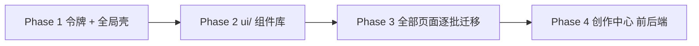
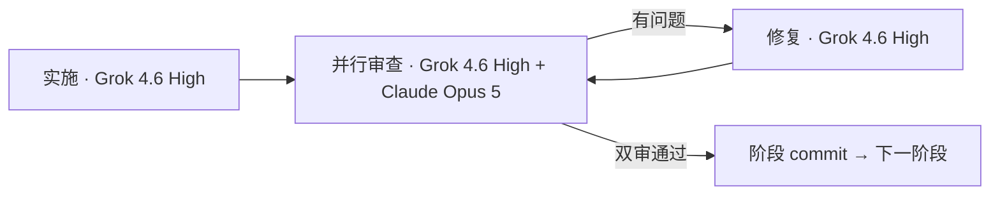

# Glass UI 重构 + 创作中心（分四阶段）

## 基线与约束

- 基线：`git fetch origin` 后从 `origin/personal-main`（`f1c8ab7d`）创建 `feat/glass-ui-redesign`。本地 `personal-main` 落后 1 个提交，先 fast-forward。
- 设计依据：`~/Downloads/前端重构参考AgentBox (3)/Sub2API Redesign.dc.html` + `Sidebar.dc.html`（令牌、组件映射表、路由→模板矩阵；(3) 在 (2) 基础上新增 `08 移动端 · 三个核心页面`）。

## 移动端标准（来自设计稿 08，所有阶段统一遵守）

- 断点 `<768px`：AppShell 切换为右侧抽屉导航，DataTable 切换为卡片模式，所有可点击目标 ≥44px。样张宽 390。
- 移动顶栏 56px，左 `padding 20px`、右 `16px`：30px Logo + 页面标题（display 15px/800）+ 11px muted 副标题（页面上下文，如邮箱、"5 个密钥 · 3 个活跃"）；右侧 40×40 图标按钮（铃铛带红点、汉堡菜单），间距 8px。
- 抽屉：右侧滑出，宽 300px，`padding 64px 14px 24px`，背景 `color-mix(in oklch, var(--background) 88%, transparent)` + `blur(28px)` + 左描边 + 阴影；遮罩 `rgba(0,0,0,.28)` + `blur(2px)`。头部：32px 头像 + 邮箱 + 角色，36px 关闭按钮。分类标题 10px uppercase；条目高 44px、圆角 12、字号 14、图标 19px、激活态同桌面 `sidebar-item-active`、红色数字徽标。底部 40px 双按钮（深色模式 / 语言）各 `flex:1`。
- 内容区 `padding 6px 16px 0`，块间距 12–14px；卡片圆角 14（hero 卡 18 + 渐变描边）；列表底部 120px 渐隐遮罩。
- 仪表盘：hero 卡（今日请求大数字 40px + 状态 pill + 14 根迷你柱状图 48px 高）→ 2 列统计卡（`padding 12px 14px`，数值 24px，迷你折线 24px）→ 列表卡（热门模型行：26px 图标 + mono 名称 + 百分比 + 4px 进度条）。
- 列表页（以 API 密钥为准）：3 列迷你统计（`padding 10px 12px`，数值 20px）→ 搜索框 44px + 44px 筛选按钮 → 横向滚动状态 chips（30px 高、圆角 10，激活态 `foreground` 底 `background` 字）→ 卡片列表（`padding 14`，标题 15/600 + `#id · 分组` 12 muted + 状态徽标；密钥行 40px mono 底 `foreground 4%` + 32px 复制按钮；4 列元信息 11px 标签 / 13px 值）→ 右下 FAB 主按钮 52px 高、圆角 16、`right 16 / bottom 28`（叠加 `env(safe-area-inset-bottom)`）。
- 公开首页：56px 顶栏（登录 + 36px 菜单）；状态 pill；h1 40px；14.5px 说明；44px 主/次 CTA（主按钮 `flex:1`）；控制台预览卡；横向卡片轮播（168px 宽、右侧 60px 渐隐）。
- 字体/令牌/组件与桌面完全共用，不新增移动专用令牌；仅新增布局变体（`MobileTopbar`、`MobileDrawer`、`ChipScroller`、`Fab`、DataTable 卡片模板槽）。
- 每个阶段/批次的验收都包含 390 宽视口检查（vitest 中用 `matchMedia` mock，实施时用浏览器 390 宽截图对照三张样张）。
- 许可边界：AgentBox 为 AGPL-3.0 + 商标条款，**不复制任何 CSS/TSX/图标文件**，令牌按设计稿中的 OKLCH 数值自行实现。chat-vue 为 MIT，可借用契约与状态机思路，但其 Vue 前端已在 `80649c3` 之后删除且依赖 Nuxt UI / Tailwind 4 / Router 5，不做文件级移植。
- 前三阶段后端与数据契约完全不动：`router/index.ts` 路由、`stores/*`、`api/*`、`i18n` key、`utils/featureFlags` 原样保留；视图只换 `<template>` 与样式，`<script setup>` 不改。
- 每阶段独立 commit，阶段末全部前端测试通过后再进入下一阶段。

## 像素级还原与功能保全（用户硬性要求，全阶段强制执行）

### UI 像素级还原

- **视觉对标设计稿**：`~/Downloads/前端重构参考AgentBox (3)/Sub2API Redesign.dc.html` 为唯一视觉基准（桌面 1440 + 移动 390 样张）。间距、圆角、字号、字重、行高、阴影、blur、渐变描边、玻璃透明度、hover/active 态须与样张一致（允许 ±1px 因浏览器舍入）。
- **内容用项目实际数据**：文案、数字、模型名、用户邮箱、分组名等来自真实 API / i18n / store，不硬编码设计稿 mock 数据；布局与组件层级按设计稿，数据绑定按 sub2api 现状。
- **验收方式**：每批迁移页在 1440×900 与 390×844 下截图，与对应 `data-screen-label` 屏对照；关键尺寸写入 vitest/CSS 断言（圆角、按钮高、卡片 padding、StatCard 数值字号等）。批次 1 六页 + 移动三样张为首批像素基准。
- **禁止半套换皮**：不得保留旧 `bg-gray-`* / `primary-`* / 旧卡片圆角与新版玻璃壳混用；单页内所有可见区块（含空态、骨架屏、分页、弹窗、表格工具栏）须同一套 `ui/` 组件与令牌。

### 全量页面替换（零遗漏）

- **范围**：`frontend/src/router/index.ts` 全部路由对应视图（约 73 条 path）+ 各视图引用的 layout 片段、弹窗、内嵌子组件的视觉层，均须迁移到新设计系统。
- **批次 4 收尾门禁**（未通过不得进入 Phase 4）：
  - `rg "dark:" frontend/src --glob '*.vue'` 归零（除过渡期明确豁免文件，收尾时清零）
  - `rg "bg-gray-|text-gray-|border-gray-|primary-[0-9]" frontend/src/views` 归零
  - `rg "class=\"card |class='card " frontend/src/views` 等旧语义类归零
  - 维护 `docs/ui-migration-checklist.md`（或 plan 内表格）逐路由勾选：路径、模板类型、迁移 commit、像素截图、spec 通过
- **未在设计稿单独出图的页面**：套用 07 组件规范 + 同模板已迁移页（ListPage → KeysView 范式；DashboardPage → AdminDashboard 范式；Settings → SettingsView 范式），不得因无样张而跳过或仅改顶栏。

### 功能零回归

- **脚本层冻结**：迁移时 `<script setup>` 默认不改；仅允许为适配新组件 props/slots 做最小接线（如把 `class` 换成 `GlassCard` 包裹）。禁止删改 API 调用、权限判断、`featureFlag` / `hideInSimpleMode` / `isSimpleMode` / `backendModeEnabled` 分支、表单校验、路由守卫依赖的 DOM id/`data-tour` 锚点。
- **行为清单每批必验**：该批路由在 admin / user / simple / backend 四种模式下 smoke（能进页、列表能加载、主 CTA 可点、创建/编辑/删除流程可走通）；现有 vitest 全绿；onboarding tour 锚点仍可达。
- **审查门禁**：Opus 审查除代码质量外，必须逐条核对「该批路由是否全部换皮」「是否残留旧样式类」「是否破坏 spec / tour / featureFlag」。

## 顺序

## 执行方式（每阶段固定三步）

- 实施：`cursor-grok-4.6-high` 子代理（非 fast），按本阶段任务清单开发并跑通该阶段验证命令。
- **并行审查（自 Phase 1 Round 4 起）**：同时启动两个审查子代理，各自独立输出问题清单，主会话合并去重后交给修复：
  - `cursor-grok-4.6-high` — 侧重实现细节、测试覆盖、与代码库惯例一致性、遗漏的边缘路径
  - `claude-opus-5-thinking-high` — 侧重行为回归、架构/可访问性、像素与功能保全门禁、长期可维护性
  - 合并规则：Blocking 任一方提出即 Blocking；Should fix / Nit 取并集；冲突时以更严项为准。修复子代理 prompt 须附**合并后的完整问题清单**（标注来源：grok / opus / both）。
- 修复：`cursor-grok-4.6-high` 子代理按合并清单修复，再交**双审**；双审均通过（或合并后零 Blocking + 已处理 Should fix）后由主会话提交阶段 commit。
- 主会话负责：分支/提交、阶段间上下文交接、并行审查调度与意见合并、阻塞时向用户汇报。
- Phase 3 的四个批次每批独立走一遍三步流程（含双审）。

## Phase 0 — 分支

- `git fetch --all`，`git checkout personal-main && git merge --ff-only origin/personal-main`，`git checkout -b feat/glass-ui-redesign`。

## Phase 1 — 设计令牌与全局壳

- 新建 `frontend/src/styles/tokens.css`：`--canvas/--background/--surface(-secondary/-tertiary)/--border/--muted/--foreground/--accent/--success(-text)/--warning(-text)/--danger(-text)/--code-bg/--shadow/--shadow-hover/--btn-hi/--field-shadow/--display`，挂在 `html[data-theme=glass-light|glass-dark][data-accent=blue|sky|indigo|teal|violet]`。字体退到系统栈（`-apple-system, PingFang SC, Segoe UI` + `ui-monospace`），不外链 Google Fonts。
- `tailwind.config.js`：新增语义色 `accent/surface/surface-2/surface-3/border-token/muted/fg/success/warning/danger` 指向 CSS 变量；保留 `darkMode: 'class'`，`main.ts` 同时写 `html.dark` 与 `data-theme`，过渡期双轨（`ThemeProvider` 逻辑收进 `composables/useTheme.ts`）。
- `style.css` `@layer components` 增加 Glass 语义类（`.glass-card`、`.badge-tone-*`、`.field`、`.segmented`、`.sidebar-item`），透明度统一用 `color-mix(in oklch, ...)`，不依赖 Tailwind 的 `/opacity` 修饰符。
- 重做 `components/layout/AppLayout.vue`（AppShell：浮动侧栏 + 透明顶栏 + 内容区 padding 8/24/24/20）、`AppSidebar.vue`（`NavItem` 新增 `section` 字段，按 `authStore.isAdmin` 渲染分类，管理员末尾「我的账户」默认折叠；保留 `featureFlag/hideInSimpleMode/expandOnly/badge`、`#sidebar-group-manage`、`#sidebar-channel-manage`、`[data-tour="sidebar-my-keys"]` 锚点、`mobileOpen` 抽屉、`sidebarScrollTop`、`custom_menu_items` v-html 图标；折叠态 60px）、`AppHeader.vue`（面包屑 + 文档/通知/主题图标按钮 + 余额 + 用户菜单）。
- 校验现有 `Select`/`DateRangePicker`/Tooltip/下拉是否使用 `position: fixed` 处于 `backdrop-filter` 容器内，必要时改 Teleport 到 body。
- 移动壳（按「移动端标准」）：`<768` 时 `AppHeader` 切为 `MobileTopbar`（Logo + 标题/副标题 + 40px 铃铛/汉堡）；`AppSidebar` 的 `mobileOpen` 抽屉改为右侧 300px 玻璃抽屉（头像/邮箱/角色 + 关闭按钮，44px 条目，底部 深色模式/语言 双按钮），遮罩 `rgba(0,0,0,.28)+blur(2px)`，路由切换与 Esc 关闭，打开时锁 body 滚动。
- 出口：`pnpm dev` 下所有现有页面在新壳内可用，旧页面样式不塌（双轨保证）；390 宽下抽屉与顶栏对照样张「仪表盘 · 抽屉导航展开」。

## Phase 2 — 自定义组件库 `frontend/src/components/ui/`

- 基础层：`GlassCard`（variant glass|solid|transparent；表格容器默认 solid 避免 backdrop-filter 掉帧与 fixed 裁切）、`Button`（primary|secondary|ghost|danger|icon，34/42px，`active:scale(.98)`）、`StatusBadge`（tone success|warning|danger|muted|accent，可选 dot）、`Field`/`TextInput`/`Select`（36px，12px 圆角，`--field-shadow`）、`ToggleSwitch`（32×18 表格内 / 36×20 表单）、`Checkbox`、`SegmentedControl`、`ProgressBar`（70% 警告 / 90% 危险阈值）。
- 复合层：`PageHeader`（compact|hero）、`StatCard`（label/value/sub/delta + 迷你折线）、`FilterBar`（搜索 + Select 若干 + 已选计数 + 列设置）、`SettingsSection`/`SettingRow`（240px 标签列）、`EndpointCard`、`Modal`/`Drawer`（Teleport，支持多步表单，替换现有 `BaseDialog` 样式层）、`Pagination`、`EmptyState`/`Skeleton`/`Toast` 换皮。
- `components/common/DataTable.vue` 只换表头（11px 字距 .06em + surface-secondary 45% 底）与行 hover（主色 5% + 左侧 3px 轨），保留 sticky 列、<768 卡片、虚拟滚动、排序持久化；卡片模式按样张「API 密钥 · DataTable 卡片模式」重做默认卡片（标题 + 副标题 + 状态徽标 / mono 主值行 + 复制 / 4 列元信息），并开放 `#mobile-card` 插槽。
- 移动端组件：`ChipScroller`（横向滚动筛选 chips，30px/圆角 10，激活态反色）、`Fab`（52px 主按钮，`right 16 / bottom 28 + safe-area`）、`MiniStatCard`（3 列迷你统计）、`ListFade`（底部 120px 渐隐）；`FilterBar` 在 `<768` 折叠为 44px 搜索框 + 44px 筛选按钮（其余筛选进 Drawer）。
- `ModelIcon`/`PlatformIcon`/`GroupBadge`/`PlatformTypeBadge`/`SubscriptionProgressMini`/`NavigationProgress`/支付品牌按钮：迁到令牌上，行为不变。
- 测试：每个 ui 组件一份 vitest 单测；新增 `components/ui/__tests__/designSystem.structure.spec.ts`（参照 `features/channel-monitor-v2/__tests__/designSystem.structure.spec.ts`），断言页面只用语义类不直写 `bg-gray-*`。
- 出口：组件库文档页（临时路由或 vitest 快照）覆盖设计稿 07 组件规范的全部条目；每个 `ui/` 组件附带设计稿标注的尺寸 token 单测（高/圆角/padding），供 Phase 3 像素验收复用。

## Phase 3 — 全部原页面逐批迁移（约 75 条路由 → 12 种模板，**必须 100% 覆盖**）

**原则**：每页 UI 像素级对齐设计稿同模板；业务数据与交互保持 sub2api 现状；单批内不允许「只改壳不改内容区」或「只改列表不改弹窗」。

- 批次 1（设计稿已出，**像素基准批**）：`views/HomeView.vue`（保留管理员自定义 HTML/iframe 逻辑，不扩大 `v-html` 面）、`views/auth/LoginView.vue`（OAuth/Passkey/钉钉按钮按站点配置显隐）、`views/admin/DashboardView.vue`（唯一 hero 头）、`views/admin/AccountsView.vue`、`views/user/KeysView.vue`、`views/admin/SettingsView.vue`（横向 Tab → 左侧分区导航，9 个 `activeTab` 分支不动）。每页 1440 + 390 截图与样张 01–06、08 对照后方可 commit。
- 批次 2（ListPage · 管理端）：users、groups、subscriptions、proxies、channels/pricing、channels/monitor、plugins、announcements、redeem、promo-codes、usage、audit-logs、risk-control、prompt-audit、affiliates/*、orders/*、tickets。
- 批次 3（ListPage · 用户端 + DashboardPage 其余）：usage、orders、invoices、tickets、subscriptions、available-channels；`/dashboard`、`/admin/ops`、`/admin/orders/dashboard`、`/monitor`（含 channel-monitor-v2 feature）。
- 批次 4（其余模板）：DetailPage（工单详情/新建、发票详情）、AuthLayout 其余页（register、email-verify、forgot/reset-password、dingtalk email-completion）、PaymentFlow（purchase、qrcode、stripe、airwallex；品牌色按钮不主题化）、CallbackStatus（7 条回调）、SetupWizard、EmbedPage（custom/:id、purchase iframe）、NotFound、ModelPlaza、Profile、Redeem、Affiliate、BatchImageGuide。
- 每批结束：移除该批文件的 `dark:` 变体与硬编码 `bg-gray/white/primary`，跑 `typecheck + lint + test:run`，**该批全部路由在 checklist 勾选 + 1440/390 截图存档**，390 宽逐页检查（批次 1 以三张样张为像素基准：`/home`、`/admin/dashboard`、`/keys`；其余批次沿用同一套顶栏/迷你统计/ChipScroller/卡片列表/FAB 布局），单独 commit。
- 收尾：删除 `html.dark` 双轨与旧 `primary-*` teal 色板；设置页分区导航在 `<768` 折叠为下拉；**路由 checklist 全部勾选 + 全站旧样式类 grep 归零** 后方可进入 Phase 4。
- 出口：`rg "dark:" src --glob '*.vue'` 与 `rg "bg-gray-" src` 归零，全部 265+ 现有 spec 通过。

## Phase 4 — 创作中心前后端适配性重构

### 后端（`/api/v1/creation/*`，JWT 组）

- 路由 `backend/internal/server/routes/creation.go`：
  - `POST /chat/completions`（SSE）、`POST /messages`
  - `POST /images/generations[/async]`、`GET /images/tasks/:id`
  - `GET /models?group_id=`
  - `GET/POST /sessions`、`GET/PATCH/DELETE /sessions/:id`、`GET/POST /sessions/:id/messages`
  - `GET /images`、`GET /images/:id`
- `CreationKeyResolver`：用户选 `group_id`，服务端按 (user, group) 自动创建/复用一把隐藏内部 key（`api_keys` 新增 `purpose` 列），注入与 `middleware/api_key_auth.go` 同形的 Gin 上下文后委托现有 `GatewayService`/`OpenAIGatewayService`；raw key 永不下发。透传 `session_id` 头关联 `usage_logs.session_id`。
- 新 Ent schema：`creation_session`、`creation_message`、`creation_image_job`（关联 `media_assets`，`biz_type: creation_image`）；补 `ent/schema/usage_log.go` 缺失的 `session_id`（DB 已由 migration 187 添加）。
- `migrations/2xx_creation_center.sql`，`go generate ./ent`，repo/service/handler + `wire.go` 更新并 `go generate ./cmd/server`。
- 设置项 `creation_center.enabled` 进 `PublicSettings` 与 `featureFlags.ts`，按 11 步 backend checklist 接线；`simple`/`backend` 模式按现有守卫规则处理。
- 测试：JWT 代理鉴权、key 解析、SSE 透传、会话/消息 CRUD、图片历史列表；仿 `image_task_handler_test.go`、`routes/gateway_test.go`、`api_contract_test.go`。

### 前端（`frontend/src/features/creation/`）

- 路由 `/studio`（`requiresAuth`、`featureFlag: creationCenter`），侧栏「工作台」分类新增「创作中心」，i18n `nav.studio` + `studio.*` 双语。
- `StudioPage` 三栏（会话/任务列表 · 消息流或任务网格 · Composer + 参数面板），全部复用 Phase 2 的 `ui/` 组件。
- `api.ts`（fetch + SSE reader，沿用 `AccountTestModal` 的流式解析）、`stores/creation.ts`（sessions、messages、imageTasks、queue/retry 状态机，从 chat-vue `useStudioTasks` 思路重写为 Pinia）、`mediaModels.ts`（能力型模型目录，按 `/api/v1/creation/models` 动态加载，不硬编码 group id）、组件 `SessionList`/`MessageStream`/`MessageContent`（marked + DOMPurify）/`ComposerBar`/`ModelMenu`/`TaskGrid`/`TaskCard`/`PreviewDialog`。
- 登出时清理 store（同 `subscriptions`），`useRoutePrefetch` 加相邻路由。
- 测试：store 状态机、SSE 解析、组件渲染与结构规范。

## 验证

- 前端每阶段：`pnpm run typecheck`、`pnpm run lint:check`、`pnpm run test:run`（80% 覆盖阈值）。
- 后端（Phase 4）：`go test -tags=unit ./...`，仓储用 `-tags=integration`；`golangci-lint run ./...`（depguard 层级约束）。
- 生成物 `ent/`、`wire_gen.go`、`pnpm-lock.yaml` 随提交。

